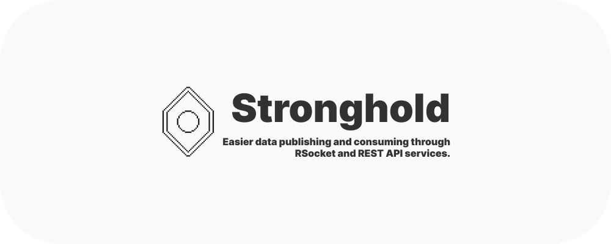

     
       
    
    
    
     
    <a href="https://git.hexalite.org/stronghold/blob/dev/next/docs/GETTING_STARTED.md">
        📚 Getting Started with Development
    </a>
    │
    <a href="https://git.hexalite.org/stronghold/blob/dev/next/docs/STACK.md">
        💵 About Stronghold's technology stack
    </a>

